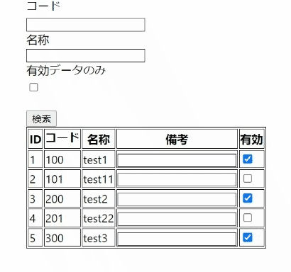

## Redux 非同期処理

Redux には、一定のコーディングルールが求められ、それらを遵守することで、アプリケーションで利用する State の状態を予測可能にし、メンテナンス性を上げることを目的にしている。

そのルールの中の一つに、Reducer 内で非同期処理を持たないという決まりがあるため、非同期処理、つまり API コールなどが必要な場合は、特別なプロセスを踏み、Reducer 処理につなげる必要がある。

<br/>

## 用語

- Store

  State が管理されている場所。

- Action

  State を更新するために必要な Javascript オブジェクト。

- Dispatch

  State を更新する際、Action を Store に送信するためのメソッド。

  dispatch(action)のように実行する。

- Reducer

  Store に属し、Dispatch された Action を元に、Store 内で State の更新を行い、更新された State のコピーを返す。

- Middleware

  非同期処理などを行う部分の総称。Reducer の手前で処理が実行される。

<br/>

## Data Flow

非同期処理が加わった Redux のデータフロー図。


<br/>

## 非同期処理を追加してみる

10.Redux で作成した Redux アプリケーションの明細部表示処理を API コールを通して行うようにする。

現時点でのアプリケーションフローは以下。

1. 初期データを表示

   初期値は features/search-item-slice.ts で定義されている。

   ```
   type SearchItem = {
     filter: {
       code: number | null;
       name: string;
     };
     items: { [id: number]: { code: number; name: string; remark: string; isValid: boolean } };
   };

   const initialState: SearchItem = {
     filter: {
       code: null,
       name: '',
     },
     items: {
       1: { code: 100, name: 'test1', remark: '', isValid: true },
       2: { code: 101, name: 'test11', remark: '', isValid: true },
       3: { code: 200, name: 'test2', remark: '', isValid: true },
       4: { code: 201, name: 'test22', remark: '', isValid: true },
       5: { code: 300, name: 'test3', remark: '', isValid: true },
     },
   };
   ```

   useAppSelector を通して、ID リストを取得して、Item Component で実際の行を表示している。

   ```
   const ItemList = () => {
     const items = useAppSelector((state) => Object.keys(state.searchItem.items), shallowEqual);

     console.log('item-list.tsx');

     return (
       <table>
         <thead>
           <tr>
             <th>ID</th>
             <th>コード</th>
             <th>名称</th>
           </tr>
         </thead>
         <tbody>
           {items.map((id) => (
             <tr key={Number(id)}>
               <Item id={Number(id)} />
             </tr>
           ))}
         </tbody>
       </table>
     );
   };
   ```

   => 初期データ取得を API コールで行う。useEffect を利用。

2. 検索ボタン押下で、検索処理 Action を Dispatch して、State を更新

   ```
   dispatch(resultFiltered());
   ```

   => API コールを行う Action に変更

3. useAppSelector は State 更新を感知し、画面描画が行われ、検索結果が表示される

   => 変更なし

<br/>

👨🏽‍💻 ハンズオン 👨🏽‍💻

Project 準備

```
cd 11.Redux
mkdir work
cd work

# 以下のフォルダをwork配下にコピー
# 11.Redux/handson/my-redux-app
cp -r ../handson/my-redux-app ./

cd my-redux-app
yarn

# 起動するか確認
yarn start

# 問題なければ停止。
# Ctrl + c
```

初期データを空にする

features/search-item-slice.ts

```
const initialState: SearchItem = {
  filter: {
    code: null,
    name: '',
  },
  items: {},
};
```

API コールを行う Action を追加

features/search-item-slice.ts

```
// 非同期処理
export const fetchItems = createAsyncThunk<
  Pick<SearchItem, 'items'>,
  undefined,
  { state: ReturnType<typeof store.getState> }
>('fetchItems', async (_, { getState }) => {
  // 本来はここでFetch処理
  const filter = getState().searchItem.filter;
  const mockData = {
    1: { code: 100, name: 'test1', remark: '', isValid: true },
    2: { code: 101, name: 'test11', remark: '', isValid: false },
    3: { code: 200, name: 'test2', remark: '', isValid: true },
    4: { code: 201, name: 'test22', remark: '', isValid: false },
    5: { code: 300, name: 'test3', remark: '', isValid: true },
  };
  const filtered = Object.entries(mockData).filter(([_id, item]) => {
    if (filter.code && !item.code.toString().includes(filter.code.toString())) {
      return false;
    }
    if (filter.name && !item.name.includes(filter.name)) {
      return false;
    }
    return true;
  });
  const result = Object.fromEntries(filtered);

  // Fetch処理で取得した値を返す
  return { items: result };
});
```

上記から返された結果を Reducer が処理する必要があるので設定を追加

また、元々の検索処理で使用していた resultFiltered は必要ないので削除する

features/search-item-slice.ts

```
const searchItemSlice = createSlice({
  name: 'searchItem',
  initialState: initialState,
  reducers: {
    codeFilterModified(state, action: PayloadAction<number>) {
      state.filter.code = action.payload;
    },
    nameFilterModified(state, action: PayloadAction<string>) {
      state.filter.name = action.payload;
    },
    itemRemarkModified(state, action: PayloadAction<{ id: number; value: string }>) {
      state.items[action.payload.id].remark = action.payload.value;
    },
    itemIsValidToggled(state, action: PayloadAction<{ id: number; isValid: boolean }>) {
      state.items[action.payload.id].isValid = action.payload.isValid;
    },
  },
  extraReducers: (builder) => {
    builder.addCase(fetchItems.fulfilled, (state, action: PayloadAction<Pick<SearchItem, 'items'>>) => {
      state.items = action.payload.items;
    });
  },
});
```

resultFiltered を export からも削除する

features/search-item-slice.ts

```
export const { codeFilterModified, nameFilterModified, itemRemarkModified, itemIsValidToggled } =
  searchItemSlice.actions;
```

ItemList の初期表示を実装

※eslint のエラーは、単純化のため無視する

item-list.tsx

```
useEffect(() => {
    dispatch(fetchItems());
    // eslint-disable-next-line
}, []);
```

検索処理の Action を変更

App.tsx

```
const onClick = () => {
  dispatch(fetchItems());
};
```

Project を実行し、処理を確認

```
yarn start
```

<br/>

## 実践

「有効」項目について検索条件を追加し、検索処理に反映させる。

<br/>

👨🏽‍💻 ハンズオン 👨🏽‍💻

1. 「有効データのみ」というチェックボックス Component を作成し、App.tsx に追加。

   この時点では、Redux に関連する内容はダミーで OK

2. search-item-slice.ts に他フィルターと同様に情報を追加していく

3. 1 で作成した Component に 2 で設定した情報を追加していく

4. 処理を確認

最終的な UI は以下。



<br/>
