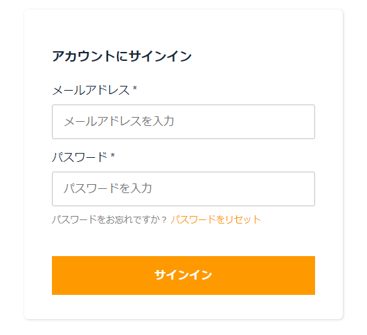
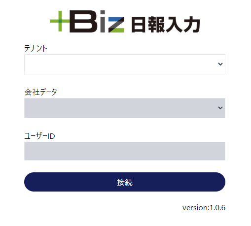

# ログイン・会社選択画面

アプリケーションの入口と、ユーザー固有の機密情報の保持を行う。

# +Biz 認証・認可

+Biz は 以下に示す 2 段階の認証・認可となっている。

1. AWS Cognito ログイン（認証）

   E メールアドレスベースで、ユーザー管理が行われている。ここの認証が完了しない限り、アプリケーションにはアクセスできない。

   サインインで認証完了後に、認証情報が付与される。ちなみに、Local Storage に保持されている。

   アプリ内で定期的に、全ページで認証情報が正常かをチェックしており、異常がある場合は Cognito ログイン画面に引き戻される。

<br/>



<br/>

2. 会社選択画面（認可）

   Azure 環境にあるどっと原価 NEO クラウド DB インスタンスへの"接続情報"を cookie に保存する。

   cookie は、Http リクエストに乗り送られるもので、API 側（Backend API）で解釈され、使用される。

<br/>



<br/>

# index.tsx

## SSR

- セッションチェック

  iron-session で保存した Cookie 情報（認可情報）が正常かどうかチェックする。iron-session は指定した Secret Key で情報を暗号化し Cookie に保存してくれるライブラリ。

  nipo_cloud_profile という cookie が存在しない場合、改ざん・なりますましの場合、また有効期限が切れている場合に異常とみなされ、False が返される。

- Redirect

  Next.js 既定の情報を入れて、redirect オブジェクトを return する。これにより、リダイレクトを実現できる。

  ```
  redirect: {
          permanent: false, // Browserにリダイレクト情報をchcheとして保存させない
          destination: '/menu', // リダイレクト先
  },
  ```

## Component

- UI 部の確認

  - \<Layout >

    meta 情報を保持する。

  - process.env

    環境変数へのアクセスを示す。

  - \<Authenticate >

    Cognito へのログイン画面コンポーネント。aws-amplify という UI ライブラリから構成している。

  - Tailwind CSS

    CSS フレームワーク。className 内で、スタイルを定義する。

    スタイリングの際は以下のサイトから必要なものを見つける。  
    ※+Biz は V2 系を使用している。

    https://v2.tailwindcss.com/

    通常の CSS で実現できることは、ほぼできると考えてよいので、"基本的に"スタイリングはこの方式で統一する。

<br/>

- データ保持(react-hook-form)

  画面で選択されたデータの保持や、接続ボタン押下時のイベントは react-hook-form というライブラリを利用している。

  form 内に情報が保持され、validation チェックなども含まれている。

  ちなみに、ログインユーザー名などの非表示情報に関しては、state で管理している。

<br/>

- テナント情報取得と認証チェック(useSWR)

  テナント情報取得時に、認証情報(access token)を用いるため、この情報に異常がある場合、エラーを返してくれる。つまりテナント情報取得と認証チェックを同時に行っていることになる。

  useSWR は、定期的なデータ取得と Rendering を行ってくれる。いわゆるクライアントサイドレンダリングの一種。

  第一引数は識別子を渡す。ここが null の場合、処理は行わない。第二引数に処理ファンクションを置く。第三引数は Options で、ここでは、エラー時の対応を明示的に示している。

  ```
    const { data: accessInfo } = useSWR(isAuthenticated ? '/api/tenants' : null, fetcher, {
      onError: (err: any) => {
        // useSWRの処理も止めているが、非同期処理がタイミングによっては走る可能性があるので、2重でチェックする
        if (!isAuthenticated) return;
        Logger.browserInfo({ caller: 'IndexPage/useSWR/onError/authSignOut', message: err });
        setIsAuthenticated(false);
      },
    });
  ```

- 各イベント

  - const handleTenantChange

    テナント選択時のイベント。

    画面表示項目の初期化と、Backend API コールを行い、選択可能な DB を取得する。

  - const handleDatabaseChange

    DB 選択時時のイベント。

    画面表示項目の初期化と、Backend API コールを行い、ユーザー ID を表示する。

  - sendRequest

    画面項目を Frontend API の store-session にリクエストし、iron-session による Cookie 保存処理を行う。

    この処理の後に、接続情報を保持した cookie が生成される。

  - signOutCognito

    Cognito からサインアウトし、かつ画面に保持する認証状態を False に変える。これにより、再レンダリングが起こり、\<Authenticate>が表示される。

- useEffect

  Cognito サインイン後に、state 関連を初期化するためにリロードを行う。

  サインイン直後に走らせたい処理のため、index.tsx を Mounting したタイミングで、イベント紐づけを行っておく。Unmounting 時はイベント削除を行っている。
